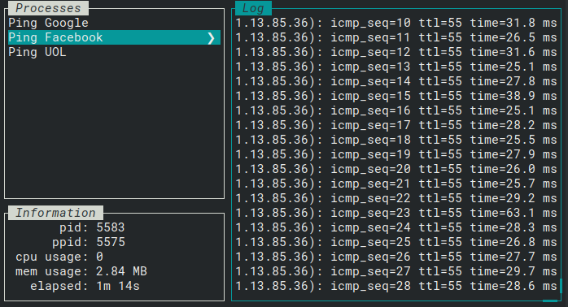

# Luminol Runner

 

# Know Issues

- [ ] Information does not appear until select a task in the 'Process Menu'

# Roadmap

- [ ] TerminalContentBox needs to be changet to cover all escape chars
    - [ ] **Erase Functions**
        - [x] **ESCc**: _clear screen and move cursor to 0x0_
        - [ ] **ESC[0J**: _clears from cursor until end of screen_
            - was done, but in a wrong way, it is erasing the entire screen and turning the cursor to 0x0
        - [x] **ESC[1J**: _clears from cursor to beginning of screen_
        - [x] **ESC[2J**: _clears entire screen_
        - [ ] **ESC[K**: _clears the current line_
        - [ ] **ESC[0K**: _clears from cursor to end of line_
        - [ ] **ESC[1K**: _clears from cursor to start of line_
        - [ ] **ESC[2K**: _clears entire line_
    - [ ] **Cursor Controls**
        - [ ] **ESC[H**: _moves cursor to home position (0, 0)_
        - [ ] **ESC[{line};{column}H**: _moves cursor to line #, column #_
        - [ ] **ESC[{line};{column}f**: _moves cursor to line #, column #_
        - [ ] **ESC[#A**: _moves cursor up # lines_
        - [ ] **ESC[#B**: _moves cursor down # lines_
        - [ ] **ESC[#C**: _moves cursor right # columns_
        - [ ] **ESC[#D**: _moves cursor left # columns_
        - [ ] **ESC[#E**: _moves cursor to beginning of next line, # lines down_
        - [ ] **ESC[#F**: _moves cursor to beginning of previous line, # lines down_
        - [ ] **ESC[#G**: _moves cursor to column #_
        - [ ] **ESC[6n**: _request cursor position (reports as ESC[#;#R)_
        - [ ] **ESC[s**: _save cursor position_
        - [ ] **ESC[u**: _restores the cursor to the last saved position_
    - [ ] **Colors / Graphics Mode**
        - [ ] **ESC[{...}m**: _Set graphics mode for cell and onward._
        - [ ] **ESC[0m**: _reset all modes (styles and colors_
        - [ ] **ESC[1m**: _set bold mode._
        - [ ] **ESC[2m**: _set dim/faint mode._
        - [ ] **ESC[3m**: _set italic mode._
        - [ ] **ESC[4m**: _set underline mode._
        - [ ] **ESC[5m**: _set blinking mode_
        - [ ] **ESC[7m**: _set inverse/reverse mode_
        - [ ] **ESC[8m**: _set invisible mode_
        - [ ] **ESC[9m**: _set strikethrough mode._
    - Reference: [ANSI Escape Sequences](https://gist.github.com/fnky/_458719343aabd01cfb17a3a4f7296797)